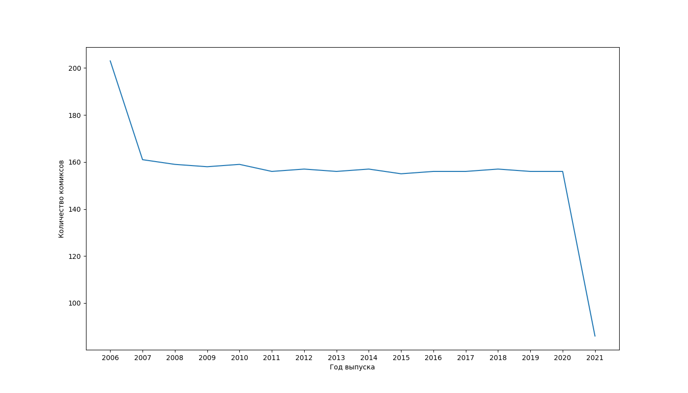

# Парсинг, анализ и визуализация данных

Скрипт [comics_parsing_goroutine.go](comics_parsing_goroutine/comics_parsing_goroutine.go) выполняет парсинг данных о комиксах с ресурса https://xkcd.com по всем доступным выпускам с 1 по 2491. А затем формирует один json-файл с данными обо всех комиксах.

После того, как json сформирован скрипт [main_script.py](main_script.py) производит обработку файла, подсчитывает количество выпусков комиксов в каждый год. А затем визуализирует эти данные и сохраняет график в виде файла [saved_figure.png](saved_figure.png)
